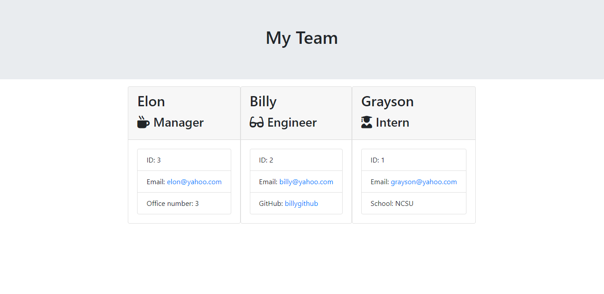

# Team Generator
A command line application built with Node.js, Inquirer and Jest.
# User Story
```
As a manager
I want to generate a webpage that displays my team's basic info
so that I have quick access to emails and GitHub profiles
```
# Table of Contents
* [Installation](#Installation "Goto Installation")
* [Usage](#Usage "Goto Usage")
* [Tests](#Tests "Goto Tests")
* [Sreenshot](#Screenshot "Goto Screenshot")
# Installation
***
Run the following comamnds to install the dependencies:
``` 
npm i 
```  
# Usage
***
Run the following to start the application:
``` 
node app.js 
``` 
# Tests
*** 
Run test with: 
``` 
npm run test 
```
# Screenshot

